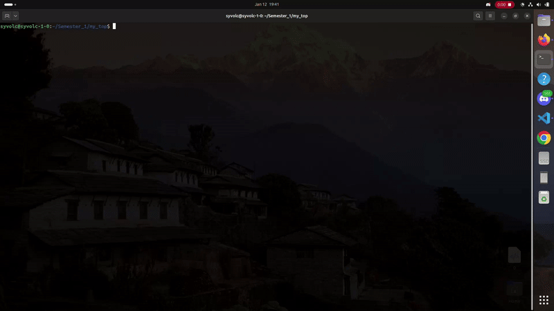

<span style="color:orange; font-size:20em;">
    <h1 align="center">
        <br>
            My Top
        <br>
    </h1>
</span>



## Subject:

* My_top is a reproduction of the command top with:
    * flags -d (time between actualisation)
    * flags -n (number of frame where the program should run)
    * 'DownArrowKey' to navigate down between different programs
    * 'UpArrowKey' to navigate up between different programs
    * 'Q Key' to exit the command
* all of the information taken by my_top is from the /proc directory or from the  /etc/passwd file

## How To Use

To clone and run this application, you'll need [Git](https://git-scm.com) and [ncurses](https://www.cyberciti.biz/faq/linux-install-ncurses-library-headers-on-debian-ubuntu-centos-fedora/). Next you can execute these commands to test the project.
```bash
#clone this repository
gitclone git@github.com:tekClovis/My_top.git My_top

#go in the repository
cd My_top

#compil the project
make

#execute the binary you can use "-h" flag for more use information
./my_top [flags]
```
